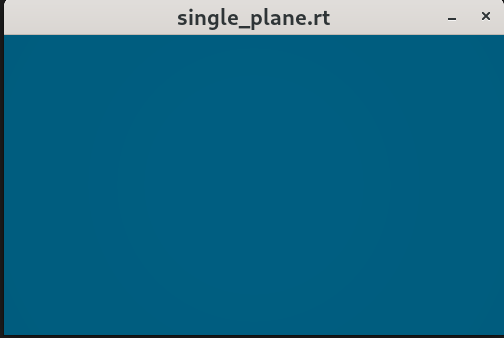
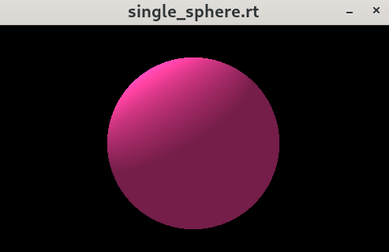
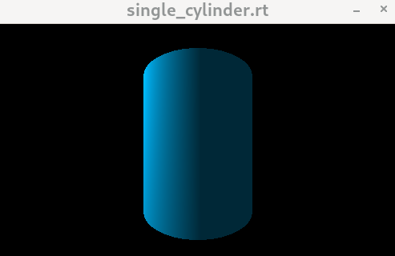
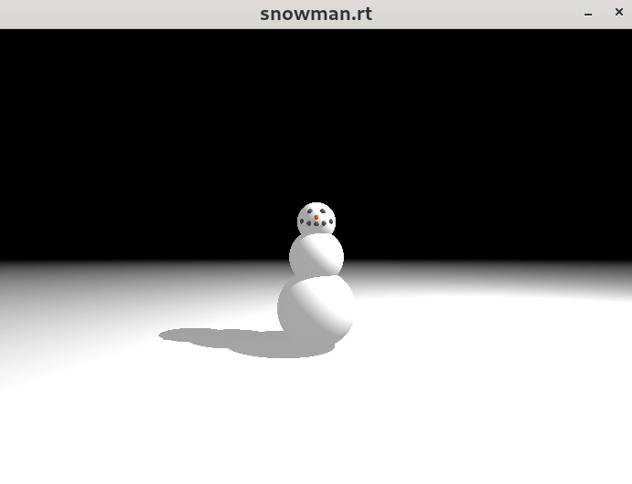
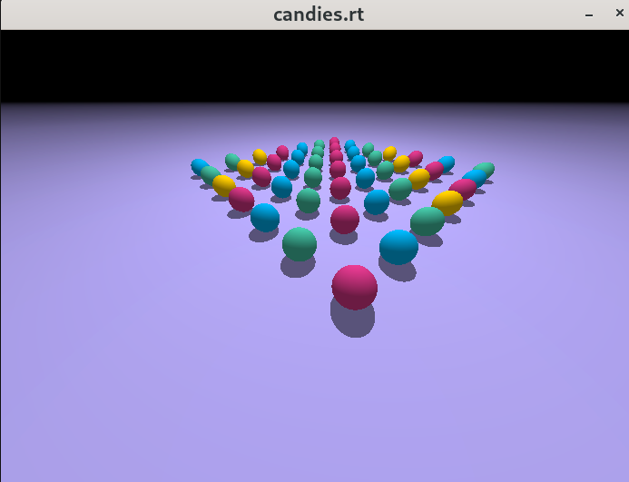
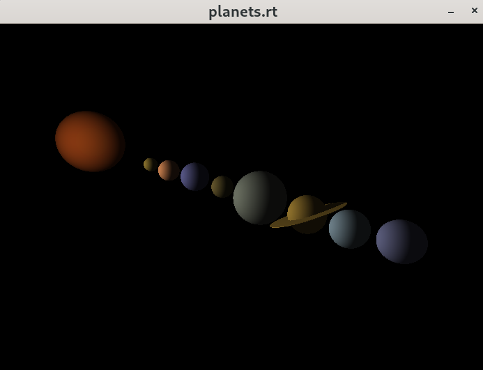

# 🖥️ miniRT - A Simple 3D Ray Tracer

This project is an introduction to the beautiful world of Raytracing.The main goal of miniRT is to prove to yourself that you can implement any mathematics or physics formulas without being a mathematician, we will only implement the most basics ray tracing features here!

## Table of contents

1. [Features](#️Features)
2. [Installation and Run](#Installation-and-run)
3. [Testing](#Testing)
4. [Some Knowledges](#Some-Knowledges)

## 🛠️ Features
- 📐 **Basic geometric objects**: Spheres, planes, cylinders.
- 💡 **Lighting & Shadows**: Ambient, diffuse.
- 🎨 **Color rendering**: Handles RGB color blending.
- 🔍 **Camera controls**: Positioning and view direction, translation and rotation.
- 📐 **Objects controls**: Positioning, translation, rotation and resizing.
- 💡 **Light control**: Positioning, translation and brightness adjustment.
- 🚀 **Simple parsing**: Reads scene descriptions from a file.


## 📦 Installation and Run

The program is written in C language for Linux distributions and thus needs the clang compiler and some standard C libraries to run.

1. Installing all the miniLibx requirements:

	```c
	sudo apt-get install -y libxext-dev && sudo apt-get install -y libxrandr-dev && sudo apt-get install -y libx11-dev && sudo apt-get install -y libbsd-dev && sudo apt-get install -y libssl-dev
	```
2. clone the project to your local:
	```c
	git clone https://github.com/Sherry5Wu/miniRT.git miniRT && cd miniRT
	```
3. then make it, it will download the minilibx-linux by itself.
	```c
	make
	```
4. Then you can render a 3D scene using the ".rt" file in the scenes folder
	```c
	./miniRT <scene_file.rt>
	```
You can modify the RT files to explore different scenes or edit them to customize the scene settings.

## 🧪 Testing

You can using ".rt" files in the scenes folder to generate 3D scenes. Below are some rendered images:

### Basic Shapes

<div style="display: flex; justify-content: center; gap: 10px;">
  
  
  
</div>

### Multi-objects (Thanks for the contributors who made these rt files)

<div style="display: flex; justify-content: center; gap: 10px;">
  
  
</div>
<div style="display: flex; justify-content: center; gap: 10px;">
  
  
</div>


To check for memory leaks:

```sh
valgrind --leak-check=full --show-leak-kinds=all ./miniRT <scene_file.rt>
```


## 📚 Some Knowledges

### What is Ray Tracing?

Ray tracing is a rendering technique used in computer graphics to simulate the way light interacts with objects in a scene, producing highly realistic images. It is widely used in movies, CGI, high-end video games, and architectural visualization.


### How Ray TRacing Works?

Ray tracing follows the path of light rays as they travel through a scene, bouncing off surfaces, refracting through materials, and interacting with objects.

1. Casting Rays

	* Rays are shot from the camera (viewer) through each pixel on the screen into the scene.
	* The first object the ray intersects determines the base color of the pixel.

2. Shading and Lighting

	* The point of intersection is analyzed to determine how light sources affect it.
	* Shadows are calculated by casting additional rays from the intersection point to the light source. If an object blocks the ray, the point is in shadow.

3. Reflection and Refraction

	* If the surface is reflective (like a mirror), a new ray is cast in the reflection direction.
	* If the surface is transparent (like glass or water), the ray bends (refraction), following Snell’s Law.

4. Global Illumination

	* Additional rays simulate indirect lighting (light bouncing off multiple surfaces), creating soft shadows and realistic ambient lighting.
	* This effect is also known as path tracing (a more advanced version of ray tracing).

### Useful books

https://www.gamedev.net/tutorials/programming/graphics/ray-tracing-part-1-r3556/

https://raytracing.github.io/books/RayTracingInOneWeekend.html

https://books.out.csli.me/NonFiction/Programming/The%20Ray%20Tracer%20Challenge-Pragmatic%20Bookshelf%20%282019%29%20-%20Jamis%20Buck.pdf

