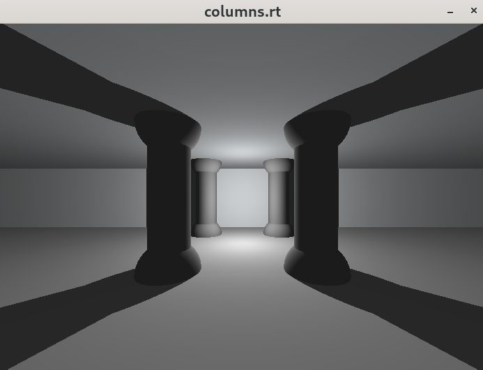

# 🖥️ miniRT - A Simple 3D Ray Tracer

This project is an introduction to the beautiful world of Raytracing.The main goal of miniRT is to prove to yourself that you can implement any mathematics or physics formulas without being a mathematician, we will only implement the most basics ray tracing features here!

## Table of contents

1. [Features](#️Features)
2. [Installation and Run](#Installation-and-run)
2.

## 🛠️ Features
- 📐 **Basic geometric objects**: Spheres, planes, cylinders.
- 💡 **Lighting & Shadows**: Ambient, diffuse.
- 🎨 **Color rendering**: Handles RGB color blending.
- 🔍 **Camera controls**: Positioning and view direction, translation and rotation.
- 📐 **Objects controls**: Positioning, translation, rotation and resizing.
- 💡 **Light control**: Positioning, translation and brightness adjustment.
- 🚀 **Simple parsing**: Reads scene descriptions from a file.


## 📦 Installation and Run

The program is written in C language for Linux distributions and thus needs the clang compiler and some standard C libraries to run.

1. Installing all the miniLibx requirements:

	```c
	$ sudo apt-get install -y libxext-dev && sudo apt-get install -y libxrandr-dev && sudo apt-get install -y libx11-dev && sudo apt-get install -y libbsd-dev && sudo apt-get install -y libssl-dev
	```
2. clone the project to your local:
	```c
	$ git clone https://github.com/Sherry5Wu/miniRT.git miniRT && cd miniRT
	```
3. then make it, it will download the minilibx-linux by itself.
	```c
	$ make
	```
4. Then you can render a 3D scene using the ".rt" file in the scenes folder
	```c
	$ ./miniRT <scene_file.rt>
	```
You can modify the RT files to explore different scenes or edit them to customize the scene settings.

## 🧪 Testing

You can using ".rt" files in the scenes folder to generate 3D scenes. Below are some rendered images:

### Basic Shapes

<div style="display: flex; justify-content: center; gap: 10px;">
  
  
  
</div>

### Multi-objects (Thanks for the contributors who made these rt files)

<div style="display: flex; justify-content: center; gap: 10px;">
  
  
</div>
<div style="display: flex; justify-content: center; gap: 10px;">
  
  
</div>

To check for memory leaks:
	```
	$ valgrind --leak-check=full --show-leak-kinds=all ./miniRT scenes/sample.rt
	```
 